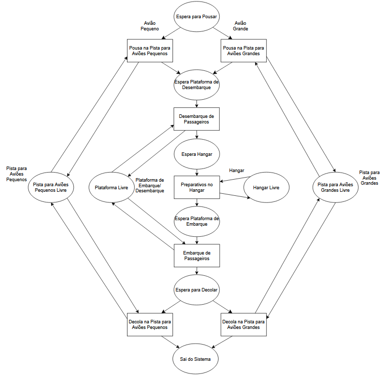

# Relatório de Simulação Discreta — Operações Aeroportuárias (Prova II)

**Universidade Federal do Pará (UFPA)**  
**Instituto de Ciências Exatas e Naturais (ICEN)** — **Faculdade de Computação**  
**Disciplina:** Simulação Discreta (EN05225)  
**Professor:** Dr. Filipe de Oliveira Saraiva  
**Alunos:** Christian Amarildo, Daniel Naiff, David Galhego e Rogério Barbosa  

---

## Sumário
1. [Apresentação do Problema e Objetivos](#1-apresentação-do-problema-e-objetivos)
2. [Modelagem ACD (Activity Cycle Diagram)](#2-modelagem-acd-activity-cycle-diagram)
3. [Implementação Computacional (SimPy / Python)](#3-implementação-computacional-simpy--python)
4. [Análise dos Cenários e Resultados das Simulações](#4-análise-dos-cenários-e-resultados-das-simulações)
5. [Identificação e Diagnóstico dos Gargalos](#5-identificação-e-diagnóstico-dos-gargalos)
6. [Análise Econômica e de Viabilidade das Soluções](#6-análise-econômica-e-de-viabilidade-das-soluções)
7. [Instruções de Execução](#7-instruções-de-execução)

---

## 1. Apresentação do Problema e Objetivos

O trabalho consiste na modelagem e simulação de eventos discretos para o planejamento de capacidade e análise de gargalos de um aeroporto comercial.

O aeroporto atende aeronaves de dois portes:
* **Pequeno Porte (P):** Opera em pistas pequenas (`pista_p`).
* **Grande Porte (G):** Opera em pistas grandes (`pista_g`).

### Fluxo Operacional das Aeronaves:
Com base na premissa de liberação imediata, os recursos são desocupados assim que a respectiva atividade finaliza:
1. **Pouso:** Solicita a pista apropriada e a libera imediatamente após a conclusão do pouso.
2. **Desembarque:** Dirige-se a uma plataforma de desembarque disponível e a libera ao fim do processo.
3. **Hangar:** A aeronave ocupa um hangar para manutenção/preparo, liberando-o ao fim desta etapa.
4. **Embarque:** Aguarda por uma plataforma disponível para embarque de passageiros/cargas e a libera assim que concluído.
5. **Decolagem:** Solicita a pista correspondente para decolar, liberando-a após o término do voo inicial.

### Tempos Operacionais Fixos (em minutos):
| Operação | Pequeno Porte (P) | Grande Porte (G) |
| :--- | :---: | :---: |
| **Pouso** | 40 | 60 |
| **Desembarque** | 20 | 40 |
| **Hangar** | 35 | 70 |
| **Embarque** | 30 | 60 |
| **Decolagem** | 40 | 60 |

---

## 2. Modelagem ACD (Activity Cycle Diagram)



*(O diagrama reflete a liberação imediata dos recursos entre as atividades, intercalando filas de espera independentes para cada fase operacional).*

---

## 3. Implementação Computacional (SimPy / Python)

A simulação foi implementada em **Python 3** utilizando a biblioteca **SimPy**.

### Arquitetura da Solução (`simulacao.py`):
* **`Metricas`:** Registra tempos de espera em fila por etapa e horário de conclusão dos voos.
* **`Aviao`:** Define o processo assíncrono da aeronave no SimPy (`operar()`). A aquisição e liberação dos recursos são gerenciadas de forma automatizada e segura utilizando Context Managers (`with recurso.request() as req:`). Isso garante que cada infraestrutura (pista, plataforma, hangar) seja imediatamente liberada após o seu tempo de serviço (`timeout`), evitando travamentos artificiais (deadlocks).
* **`simular()`:** Instancia os recursos (`pista_p`, `pista_g`, `plataforma`, `hangar`), realiza a leitura dos eventos de `chegadas.csv` e calcula o **Tempo Final de Simulação** ($TF$) e as **Filas Máximas**.

---

## 4. Análise dos Cenários e Resultados das Simulações

Foram executadas três configurações de infraestrutura para comparar o tempo de processamento total e o acúmulo de filas.

### Tabela Comparativa de Desempenho:

| Categoria | Métrica / Parâmetro | Cenário 1 <br> *(Base)* | Cenário 2 <br> *(Recomendado)* | Cenário 3 <br> *(Expansão Total)* | Redução <br> *(C2 vs C1)* |
| :--- | :--- | :---: | :---: | :---: | :---: |
| **Infraestrutura** | **Plataformas** | 5 | 5 | 7 | — |
| | **Hangares** | 3 | 3 | 5 | — |
| | **Pistas Pequeno Porte (P)** | 2 | 3 | 3 | +50% |
| | **Pistas Grande Porte (G)** | 1 | 2 | 2 | +100% |
| **Tempo Total** | **Tempo Final de Simulação** | **3.270,0 min** <br> *(~54,5h)* | **2.060,0 min** <br> *(~34,3h)* | **2.060,0 min** <br> *(~34,3h)* | **-37,0%** |
| **Filas Máximas** | **Fila (Pouso)** | 992,0 min | 324,0 min | 324,0 min | **-67,3%** |
| | **Fila (Desembarque)** | 0,0 min | 5,0 min | 0,0 min | — |
| | **Fila (Hangar)** | 10,0 min | 20,0 min | 0,0 min | — |
| | **Fila (Embarque)** | 5,0 min | 10,0 min | 0,0 min | — |
| | **Fila (Decolagem)** | 970,0 min | 330,0 min | 330,0 min | **-66,0%** |

---

## 5. Identificação e Diagnóstico dos Gargalos

A correção na modelagem de liberação de recursos deixou claro que a infraestrutura de solo (plataformas e hangares) nunca foi o gargalo real do aeroporto.

### 1. Diagnóstico do Cenário Base (Cenário 1)
O verdadeiro estrangulamento do sistema ocorre nas **Pistas**:
* **Gargalo Crítico:** As aeronaves acumulam até **992 minutos** aguardando autorização para pouso e **970 minutos** esperando para decolar. As duas pistas pequenas e a única pista grande não dão conta da densidade de tráfego aéreo.
* **Folga Interna:** Ao mesmo tempo, as filas internas (Desembarque, Hangar e Embarque) variam entre 0 e 10 minutos, provando que os 3 hangares e 5 plataformas atuais dão conta perfeitamente do fluxo *quando* os aviões conseguem pousar.

### 2. A Solução do Gargalo (Cenário 2)
Adicionar 1 Pista P e 1 Pista G ataca o problema diretamente na raiz:
* O tempo total da simulação despenca de **3.270 min para 2.060 min** (uma economia de 20 horas operacionais).
* As filas extremas de pista são cortadas em aproximadamente 67%. Pequenas filas internas surgem (5 a 20 minutos) por conta da chegada mais volumosa de aviões ao pátio, mas são facilmente absorvidas sem impactar o tempo global.

### 3. A Ineficácia da Expansão Interna (Cenário 3)
Aumentar as plataformas de 5 para 7 e os hangares de 3 para 5 **não gera benefício prático no tempo global**. O tempo final da simulação continuou estacionado nos exatos 2.060 minutos do Cenário 2, e as filas de pista permaneceram idênticas. A única mudança foi zerar as filas internas que já eram insignificantes.

---

## 6. Análise Econômica e de Viabilidade das Soluções

1. **Prejuízos do Cenário Base (Inviável):**
   * Manter aviões sobrevoando o aeroporto por mais de 16 horas (992 minutos de fila de pouso) resulta em queima insustentável de Querosene de Aviação (QAV), alto risco de segurança e colapso da malha aérea comercial.

2. **Viabilidade Econômica do Cenário 2 (RECOMENDADO):**
   * **Maior Retorno sobre Investimento (ROI):** Todo o investimento inicial (CAPEX) é direcionado exclusivamente para a pavimentação de novas pistas. Essa obra única destrava a capacidade do aeroporto, reduzindo o tempo operacional do lote de voos em 37% e aumentando o faturamento em pousos e decolagens diárias.

3. **Inviabilidade do Cenário 3 (Superdimensionamento/Over-investment):**
   * Do ponto de vista econômico, o Cenário 3 representa um erro de planejamento financeiro. A construção de 2 novas plataformas de embarque e 2 novos hangares exigiria dezenas de milhões em obras civis, desapropriações e manutenção, sem trazer **nenhuma** redução no tempo operacional das aeronaves em relação ao Cenário 2. O dinheiro seria gasto para zerar filas internas de apenas 5 a 20 minutos, caracterizando um desperdício de capital.

---

## 7. Instruções de Execução

### Pré-requisitos
* Python 3.8 ou superior
* Gerenciador de dependências moderno (`uv`) ou padrão (`pip`)
* Arquivo de dados `chegadas.csv` no mesmo diretório

### Execução via linha de comando (`uv`)
Se o `uv` estiver configurado, basta rodar o comando abaixo para que as dependências (`simpy`) sejam geridas automaticamente e o script iniciado:
```bash
uv run simulacao.py
